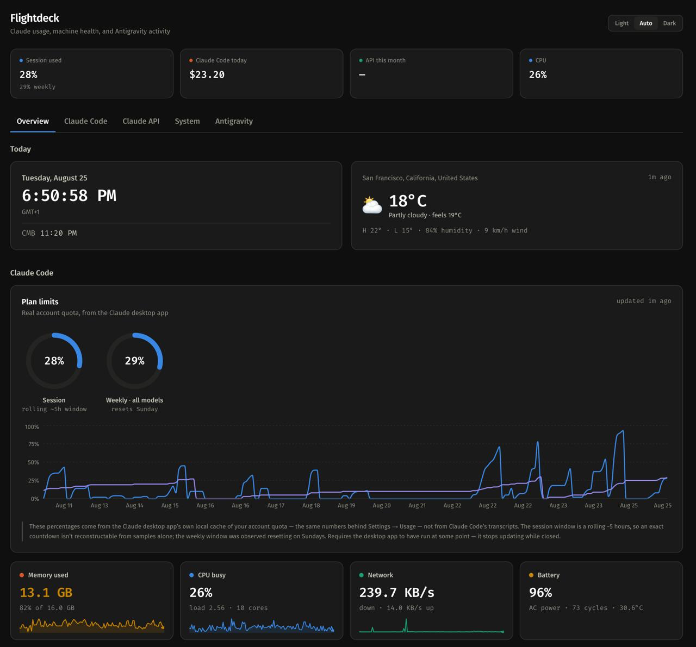

# Flightdeck

[](LICENSE)
[](https://github.com/SasankaSenanayake/flightdeck/stargazers)


A local dashboard for Claude usage, MacBook health, and Antigravity activity —
the instrument panel for one machine. Runs on `127.0.0.1:3111` only, never
exposed to the network.



*Weather location shown is a demo value (San Francisco) for this screenshot —
spend, quota %, and system stats are real, live numbers from the machine this
was captured on.*

Everything it shows is either read straight off your own disk (Claude Code's
transcripts, the Claude desktop app's own usage cache, Antigravity's local
state) or pulled from an API you configure yourself. No telemetry, no
third-party analytics, nothing phoned home beyond the specific integrations
you turn on.

## Prerequisites

- **macOS.** The System panel shells out to `iostat`, `vm_stat`, `netstat`,
  `ps`, `df`, `pmset`, and `ioreg` — all Darwin-only. This will not run
  correctly on Linux or Windows.
- Node.js 20+, npm.

## Getting started

```bash
git clone https://github.com/SasankaSenanayake/flightdeck.git
cd flightdeck
npm install
cp .env.local.example .env.local   # fill in whichever integrations you want
npm run dev
```

Open `http://127.0.0.1:3111`. Every panel works with `.env.local` left empty —
each renders its own "not configured" state with exact setup instructions
rather than an error.

## Panels

### Today (date/time, weather)
A live clock and current weather — general-purpose widgets, not Claude-specific,
shown at the top of the Overview tab.

**Weather** geocodes `WEATHER_LOCATION` (a free-text city name, e.g.
`"Richmond, England"`) once via Open-Meteo's free geocoding API, then polls
current conditions every 15 minutes. No API key required. Both responses are
cached in SQLite (30 days for the geocode, 15 minutes for conditions) so
restarts don't re-geocode. Because Open-Meteo matches place names verbatim
rather than parsing `"City, Country"` itself, the geocoder splits off a
trailing country and maps it to an ISO 3166-1 code — the kind of place-name
collision this guards against is real (there are three unrelated Richmonds:
London, Virginia, and British Columbia).

*Calendar and inbox:* rather than a secret iCal URL baked into this app, that
piece now lives as a companion page published through Claude, using the `mcp`
capability to call your own connected Google Calendar / Gmail connectors live
— no long-lived secret token stored anywhere. That's a separate, personal
artifact outside this repo's scope; the pattern is straightforward to
reproduce if you want your own.

### Plan limits (real quota)
The Claude **desktop app** caches its own account-synced usage percentages at
`~/Library/Application Support/Claude/plan-usage-history.json`, sampled every
~15 minutes while it runs — the same numbers behind its own Settings → Usage
pane. This is the one source in this dashboard that is genuine account quota,
not a token-derived estimate: session (a rolling ~5-hour window) and weekly
(7-day, all models, observed resetting Sundays). Requires the desktop app to
have been opened at least once, and it stops updating while closed — the card
flags this with a visible staleness warning rather than showing a silently
frozen number.

### Claude Code (subscription)
Reads `~/.claude/projects/**/*.jsonl` directly. Per-request model, token counts
(including the 5-minute vs 1-hour cache-write split), project, branch, and effort.

Two things this gets right that a naive reader would not:

- **Deduplicated by `requestId`.** One API request emits several assistant lines
  — one per content block — each carrying the *same cumulative* usage object.
  Measured here: 6,289 usage-bearing lines collapse to 3,255 real requests, every
  duplicate byte-identical. Summing lines overstates cost by ~93%.
- **Subagent transcripts included.** 91 of 122 transcripts live in
  `<project>/<sessionId>/subagents/`, not the session file. A single-level scan
  silently drops ~18% of billed requests.

Costs are *equivalent API value* — what the same work would cost at list prices —
not a charge against your plan. Prices resolve per-day, since list prices change
over time (e.g. an introductory rate ending on a fixed date).

Trailing 5-hour and 7-day windows are shown as **consumption**, not quota. Real
plan limits are enforced server-side and are not exposed to any local client, so
there is no honest way to render "% of plan used" from transcripts alone — that
number comes from the Plan limits panel above instead.

### System
Everything unprivileged; `powermetrics` needs sudo, so per-core power and
thermals are out of scope.

**Creating a process costs ~200ms on this machine** — the commands themselves are
free, so spawn overhead dominates entirely (four parallel spawns measured at
~690ms; batching them into one `sh -c` saves nothing, because the cost is per
process created). So `iostat -w 1`, `vm_stat 1`, and `netstat -w 1` each run
**once** as long-lived streams and the API reads the newest row. That took
`/api/system` from **1.37s to 6ms**. Disk, battery, and the process list still
spawn, but are cached at 60s/30s/5s — well past the 2s poll.

Samples are written to SQLite every 60s and pruned after 30 days. Key stat tiles
carry a sparkline of the last 2 hours.

### Antigravity
Antigravity stores **no token or credit counts on disk** — `modelCredits` holds
only protobuf sentinels. Two sources are used instead:

- **Live quota (opt-in).** Set `ANTIGRAVITY_LIVE_QUOTA=1` to reuse the IDE's
  cached Google access token against the same undocumented Cloud Code endpoint
  the IDE itself polls. The token goes only to Google, its own issuer; the
  refresh token is deliberately never touched. It expires roughly hourly, so
  expect this to fail unless Antigravity was open recently — every failure falls
  back cleanly, and no token material ever appears in an API response.
- **Local state (always).** `state.vscdb` is copied to a temp file and opened
  read-only — the IDE holds the original open with WAL, and writing to it could
  corrupt the running editor. Agent trajectories are decoded from an
  undocumented nested protobuf with a structural wire-format reader; malformed
  records are skipped rather than failing the panel.

IDE uptime is reconstructed from `loadCodeAssist` heartbeats (one per ~5 min),
with a >15 min gap ending a session. This measures **the IDE running**, not time
spent actively working. Log-directory mtimes are not usable for this — they
report a flat 24h every day the app merely stayed open.

## Design

Fira Code / Fira Sans throughout — every number renders in a real monospace
built for data, not a proportional-font approximation. Categorical chart colors
come from a colorblind-safe palette (validated for CVD contrast in both light
and dark). Dark/light/system theme switching, no flash of the wrong theme.

## Always-on

```bash
./deploy/install.sh
```

Builds, then installs a launchd agent that starts at login and restarts on crash.
Docker is deliberately not used: Docker Desktop runs a Linux VM, so `vm_stat`,
`pmset`, and `ioreg` would not exist in the container and `/proc` would describe
the VM rather than the Mac.

The agent pins node's absolute path because launchd gets a minimal PATH and
cannot resolve nvm — **re-run `install.sh` after switching node versions**.

```bash
./deploy/uninstall.sh    # remove the agent; project and data untouched
tail -f data/dashboard.log
```

## Configuration

`.env.local` (mode 600, gitignored — copy `.env.local.example` to start):

| Variable | Purpose |
|---|---|
| `ANTIGRAVITY_LIVE_QUOTA` | `1` to attempt the live Antigravity quota lookup. |
| `WEATHER_LOCATION` | Free-text city for the Weather widget, e.g. `"Richmond, England"`. |

Every variable is optional — leave any of them blank and that panel shows a
clear setup card instead of an error.

## Footprint

Measured with the dashboard open and polling every 2s: **0–2% of one core,
80–106MB RSS** across the Node server and all three stream samplers, each of
which sits at 0.0% CPU and 1–3MB. With the tab closed, only the 60s collector
runs. Polling is gated on `document.visibilityState`.

## Security

- Binds to `127.0.0.1` only — never reachable from the network, verified with
  `lsof` after install.
- `.env.local` and the SQLite database are gitignored; `.env.local.example`
  ships with every key blank.
- Antigravity's cached Google access token, when the opt-in live-quota lookup
  is used, is sent only to Google's own endpoint and is never logged, returned
  in an API response, or written to disk by this app.

Found a real security issue? Please open a GitHub issue.

## License

[MIT](LICENSE) — © 2026 Sasanka Senanayake.
